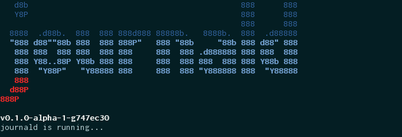
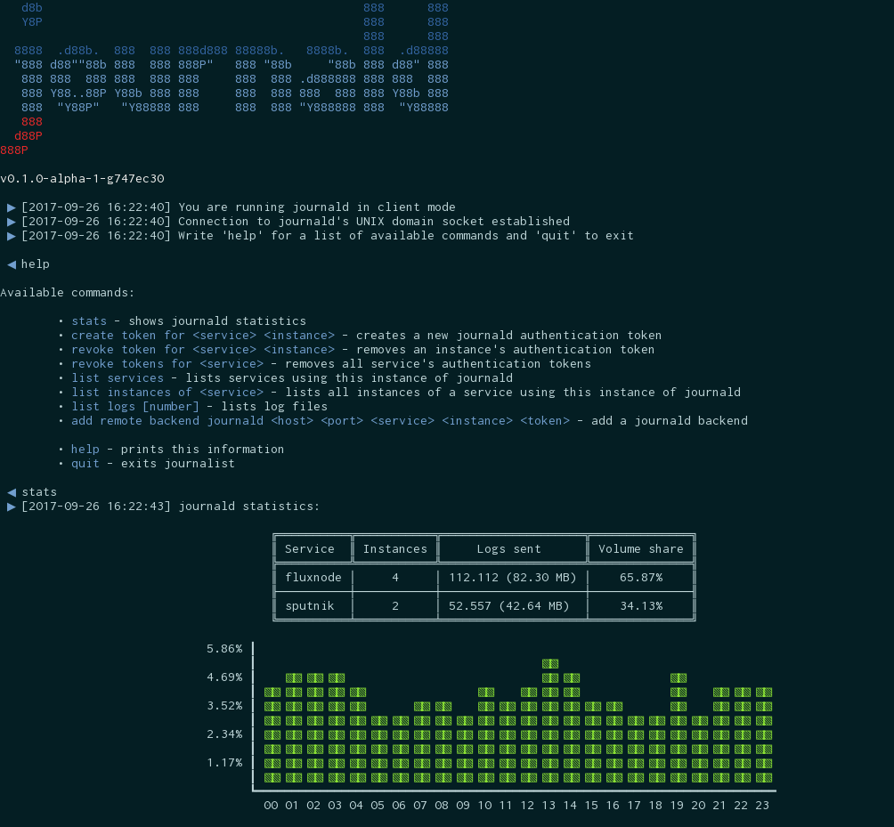
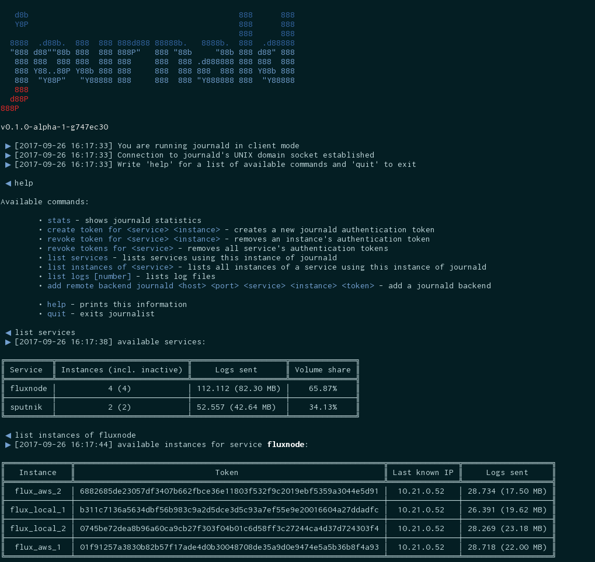

# journal [](https://godoc.org/github.com/vaitekunas/journal) [](https://goreportcard.com/report/github.com/vaitekunas/journal) [](https://travis-ci.org/vaitekunas/journal) [](https://coveralls.io/github/vaitekunas/journal?branch=master)

<video style="width: 688px; height: 288px;" loop="" autoplay="">
 <source src="doc/video/journald.mp4" type="video/mp4">
 Your browser does not support the video tag.
</video>

`journal` is a golang logging facility capable of writing structured log messages to many
`io.Writer` interfaces as well as remote backends. The default remote backend (`journald`)
uses `gRPC` as the transport layer.

`journal` in a nutshell:

* Structured logging
* Selection of relevant columns for local logs
* Built-in/custom error messages
* Output to files and stdout locally
* Writes to any backend implementing the `io.Writer` intarface
* File rotation (daily, weekly, monthly, annually)
* Old log file compression
* Remote logging/mirroring via grpc
* Tab-delimited or JSON-formatted output (output to stdout is always tab-delimited)
* Supported connection to other backends (e.g. `kafka`, `influxDB`, etc.)

## Logging locally

In order to log messages locally, an instance of the `journal.Logger` interface
(struct implementing the interface) must be created:

```Go
// Prepare logger config
// (displaying all config values for the sake of clarity)
config := &journal.Config{
  Service:  "My microservice",
  Instance: "My instance",
  Folder:   "/var/logs/myservice",
  Filename: "myinstance",
  Rotation: journal.ROT_DAILY,
  Out:      journal.OUT_FILE_AND_STDOUT,
  Headers:  true,
  JSON:     false,
  Compress: true,
  Columns:  []int64{ // leaving blank would use default columns
    journal.COL_DATE_YYMMDD,
    journal.COL_CALLER,    
    journal.COL_MSG_TYPE_STR,
    journal.COL_MSG,
  },
}

// Create a new logger
logger, err := journal.New(config)

if err != nil {
  log.Fatal(err.Error()) // ironically
}

// Log a simple message/error
logger.Log("Caller name", 0, "Hello, World!")

// Log a message/error with custom fields
logger.LogFields("Caller name", 0, map[string]interface{
  "From":    "Caller name",
  "To":      "World",
  "Message": "Hello!",
})
```

If some part of your code uses `logger.Log` or `logger.LogFields` very often, it
could prove more comfortable to create dedicated logging functions:

```Go
msg := logger.NewCaller("Caller name")
info := logger.NewCallerWithFields("Caller name")

// Log a simple message/error
msg(0, "Hello World")

// Log a message/error with custom fields
info(0,  map[string]interface{
  "From":    "Caller name",
  "To":      "World",
  "Message": "Hello!",
})
```

### Logging and returning an error

Sometimes people want to log *and* return an error. Even though there are reasons
not to do it (a more idiomatic approach is to either log *or* return), `journal`
supports this too:

```Go
// HandlerLogin should verify user credentials and create an auth token, but is
// not yet implemented
func (s *Service) HandlerLogin(user, password string) error{
  return s.Logger.Log("HandlerLogin",404,"Login facility not yet implemented!")
}

```

see `log_codes.go` for a list of built in log codes and their status (error or not).
You can set/overwrite all or some of the log codes with `Logger.UseCustomCodes(codes map[int]Code)`

## Starting a remote logging facility (aggregator/mirror)

Package `journal` consists of two main libraries:
* `journal` - a library used for logging messages of a service
* `server` - a library for running a gRPC+UNIX domain socket server for receiving and relaying log messages coming from a service using journal or implementing its protobuf API.

This repository also provides a command line utility `journald` which handles all
the steps necessary to start a `journal` server or connect to it.
In order to use `journald` as a remote backend for services that use `journal`
as their logging facility, I recommend you compile and install the `journald`
binary, i.e.:

```shell
go get -u github.com/vaitekunas/journal
go install github.com/vaitekunas/journal/cmd/journald
```

Having the `journald` binary available to your user (make sure `$GOPATH/bin`
is included in your `$PATH`) makes it easy to start the server and connect to its
management console via a UNIX domain socket:

```
journald start-server --help

Usage of start-server:
  -compress
    	Compress rotated logs (default true)
  -filestem string
    	Log filename stem (without date and extension) (default "aggregate")
  -folder string
    	Logserver's folder to store logs in (default "/var/logs/logsrv")
  -headers
    	Always print headers (default true)
  -host string
    	Remote logger's host (default "127.0.0.1")
  -json
    	Print logs encoded in json (default true)
  -output string
    	Log output mode: {file|stdout|both} (default "file")
  -port int
    	Remote logger's port (default 4332)
  -rotation string
    	Log rotation mode: {none|daily|weekly|monthly|annually} (default "daily")
  -stats string
    	Remote logger's statistics (default "/opt/journald/stats.db")
  -tokens string
    	Remote logger's access tokens (default "/opt/journald/tokens.db")
  -unix-socket string
    	Remote logger's unix socket file (default "/var/run/journald.sock")
```

Mirroring local logs or metrics remotely is a nice way of aggregating information about
a set of your services/instances in one place.

```shell
journald start-service \          
          --folder=$HOME/logs/ --file=myservice --output=both \
          --rotation=daily --compress=true \          
          --tokens=$HOME/logger/tokens.db
          --stats=$HOME/logger/stats.db
```



### Logging remotely

In order to pass local messages to a remote instance of `journald`, use `connect.ToJournald` to establish a gRPC connection and then `Logger.AddDestination`
to add this backend to your local logger's stack of outputs:

```Go
// import "github.com/vaitekunas/journal/connect"

service := "My service"
instance := "My instance"
host := "127.0.0.1"
port := 4332
token := "0745be72dea8b96a60ca9cb27f303f04b01c6d58ff3c27244ca4d37d724303f4"

journald, err := connect.ToJournald(host, port, service, instance, token, 5*time.Second)

if err != nil {
  notify(1, "Could not connect to log server: %s", err.Error())  
}else{
  logger.AddDestination("journald", journald)
  notify(0, "Connection to journald (%s:%d) established!", host, port)
}
```

You can connect your logging facility to as many destinations (`journald` and other)
as you wish. This might prove redundant though.

### Managing a running journal server

If you're running `journald` as a remote backend, you can use its built-in management
console to add/remove services and their instances, view statistics and connect `journald`
to other backends:

```Go
journald connect --sockfile="/var/run/journald/.sock"
```

Having connected to the server, you can see its statistics:



manage its auth tokens needed by the microservices in order to send messages:



and so on.

### Mirroring journald

`journald` (the server) can connect to further `journald` backends or other remote
services (kafka, influxDB, etc.). This way you can create real-time backups or pass
aggregated logs to, say, kafka, instead of doing this for each logging instance.

### Using journald for other types of messages

You can use the `journald` server to gather other types of messages without using
the `journal` library. Simply generate a `*.pb.go` file from the `librpc/log.proto`
protobuf stub and use the resulting client to connect to `journald` and send messages.

# Build

`journal` imports the `logrpc` subpackage, which is generated from a protobuf definition,
so that in order to build `journal` you first need to generate the golang stubs for it:

```shell
protoc --go_out=plugins=grpc:. protobuf/log.proto
```

# TODO

 - [x] Put `journal.ConnectToKafka` to a separate library
 - [ ] Create a make file
 - [ ] Increase test coverage
